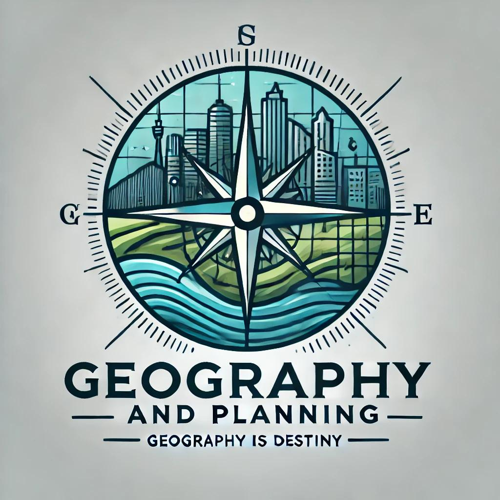

# Welcome to the Geography and Planning Organization!

## 🙋‍♀️ Introduction
This GitHub organization shares a wealth of geographical and planning information and tools, which are crucial for future development.
Some valuable sources include online and in-person planning and programming classes.
This organization aims to share its tools and resources with others who wish to explore the geospatial or planning world.

## 🌈 Contribution guidelines
We encourage all kinds of contributions and resources. Any help would be greatly appreciated.
If you want to contribute or join the organization, please DM the manager via email, LinkedIn, or start a pull request.
Feel free to email the manager: opengeosgithub@gmail.com

## 👩‍💻 Useful resources
Currently, most resources are still underdeveloped.
Most of the repository content is quite suitable for programming beginners.

## 🍿 Fun facts & about the manager

Zhanchao Yang

> **Transportation Research Assistant**
> *Master of City Planning & Master of Urban Spatial Analytics*
> Department of City and Regional Planning
> Weitzman School of Design
> University of Pennsylvania

Feel free to visit him [github](https://github.com/zyang91)
